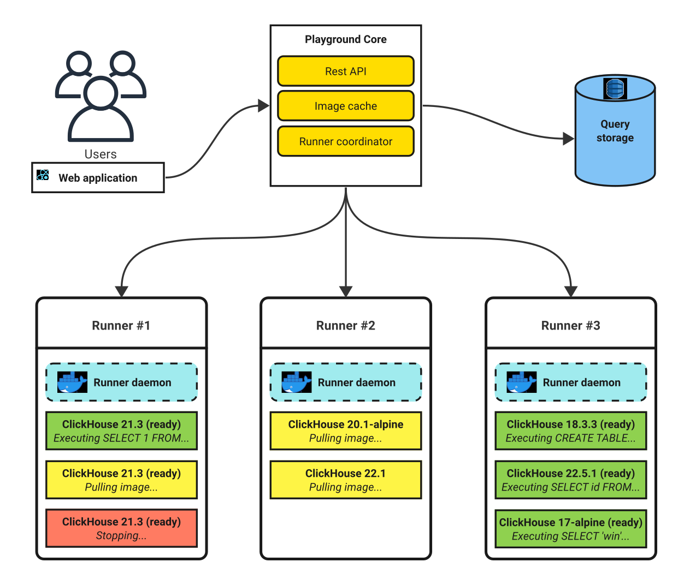

# ClickHouse Playground

ClickHouse Playground allows running SQL queries from a browser without having a database instance on the user's side.
It allows to run any queries in arbitrary ClickHouse version
and share the execution results with others.

Try it out: [fiddle.clickhouse.com](https://fiddle.clickhouse.com).

You can read about the motivation and more technicalities at the [About](./docs/about.md) page.

## Architecture overview

---

There is a coordinator that creates a Docker container with a desired ClickHouse
version for every incoming user request. Containers are created on runners,
these can be both remote servers and the local system.

When the execution finishes (or force stopped due to timeouts),
the result is saved in a query storage and is returned to the user.
The saved result can be accessed by the generated ID.

Users communicate with the playground using REST API.

## Useful links

---

- [Playground](https://fiddle.clickhouse.com/)
- [Documentation](./docs/readme.md)
- [Installation guide](./docs/install.md)
