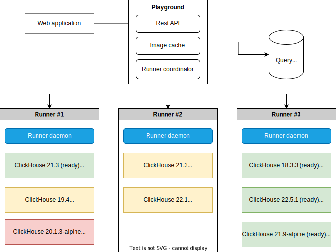

# ClickHouse Playground

ClickHouse Playground is a tool for running SQL queries online, from a browser.
It allows ClickHouse community to run any queries in arbitrary ClickHouse version
and share the execution results with others.

Try it out: [playground.lodthe.me](https://playground.lodthe.me).

This repository contains back-end logic of the platform. 
The source code of the web application is available [here](https://github.com/lodthe/clickhouse-playground-ui).

## Architecture overview

---

There is a coordinator that creates a Docker container with a desired ClickHouse
version for every incoming user request. Containers are created on runners,
these can be both remote servers and the local system.

When the execution finishes (or force stopped due to timeouts),
the result is saved in a query storage and is returned to the user.
The saved result can be accessed by the generated ID.

Users communicate with the playground using REST API.

## Useful links

---

- [Playground](https://playground.lodthe.me/)
- [Documentation](./docs/readme.md)
- [Installation guide](./docs/install.md)